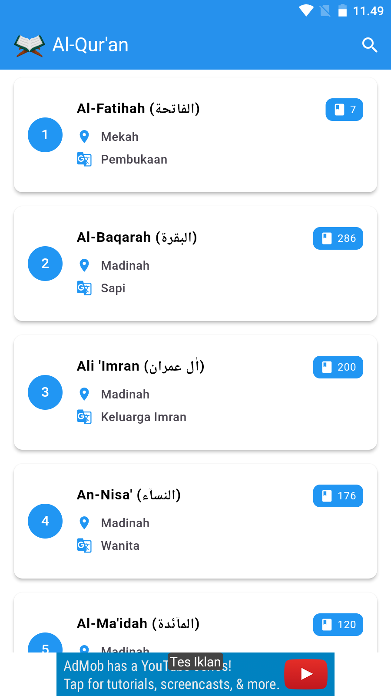
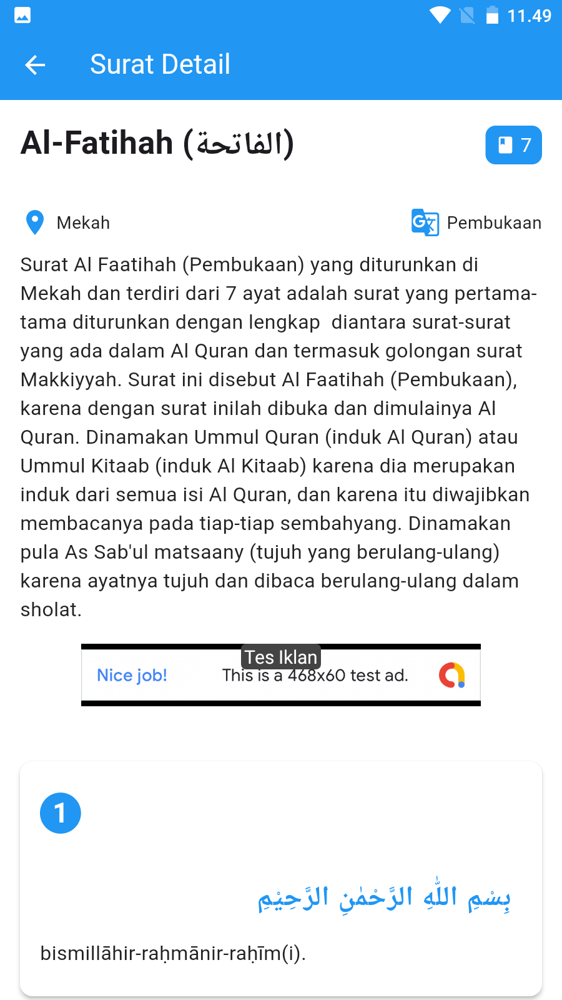
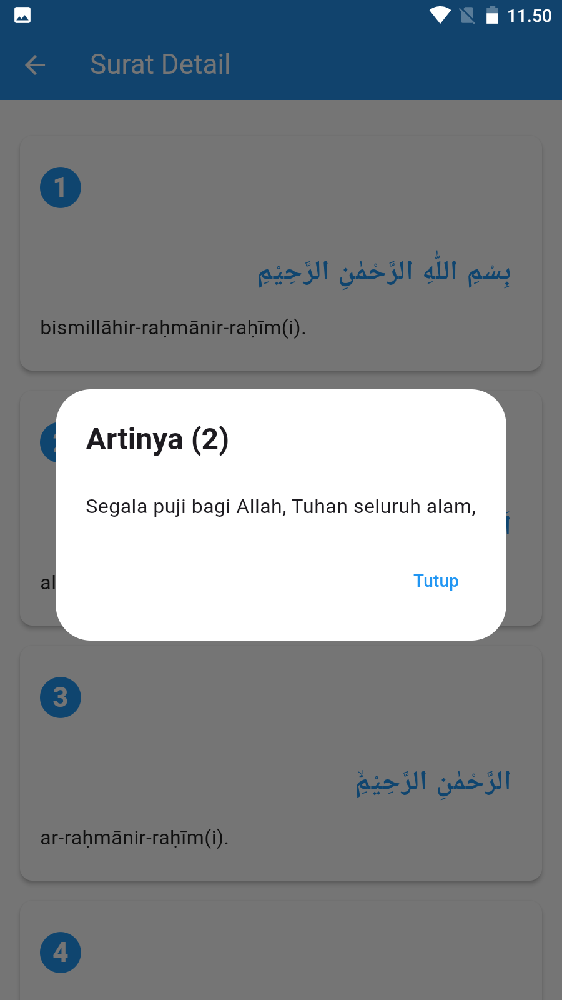

# Quran Flutter

Application makes it easier to read and understand the Koran. Key features include translation, search, and latin

## Development Tools

- Flutter 3.27.1
- Tools • Dart 3.6.0 • DevTools 2.40.2

## Run Program

- `git clone https://github.com/fitri-hy/quran-flutter.git`
- `cd quran-flutter`
- `flutter pub get`
- `flutter run`

## Generates Keystore

```
keytool -genkeypair -v -keystore quran-key.keystore -keyalg RSA -keysize 2048 -validity 10000 -storepass 220898 -keypass 220898 -alias quran
```

## Changing Package Name

```
flutter pub global activate rename
flutter pub global run rename --bundleId com.example.newname
```

## Build & Release

```
flutter build apk --release
flutter build appbundle
```

<div style="display: flex; flex-wrap: wrap;">
  
  
  
</div>

## AdMob Settings

- Go to: `lib/services/AdMobConfig.dart`

```
class AdMobConfig {
  static const String adUnitId = 'ca-app-pub-xxxxxxxxxxx';
}
```

- Go to: `android/app/src/main/AndroidManifest.xml`

```
<meta-data
android:name="com.google.android.gms.ads.APPLICATION_ID"
android:value="ca-app-pub-xxxxxxxxxxxxxxxxxx" />
```